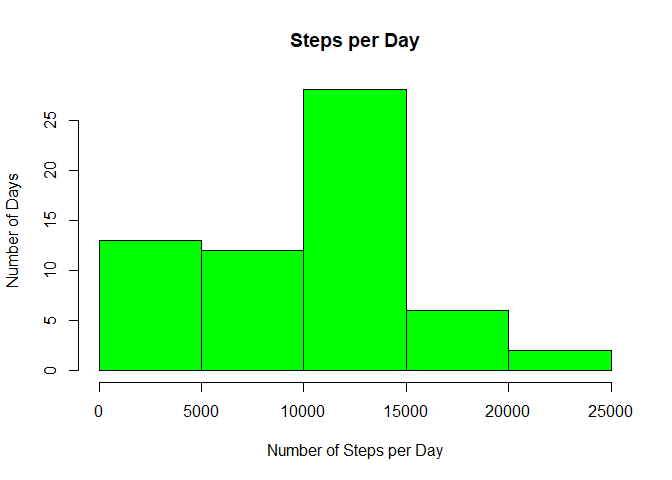
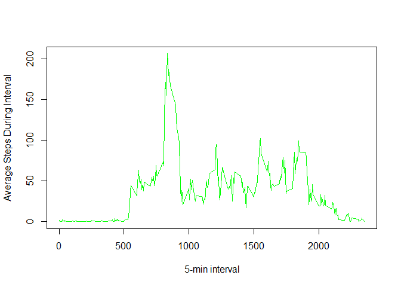
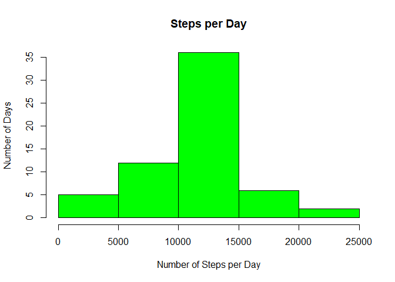
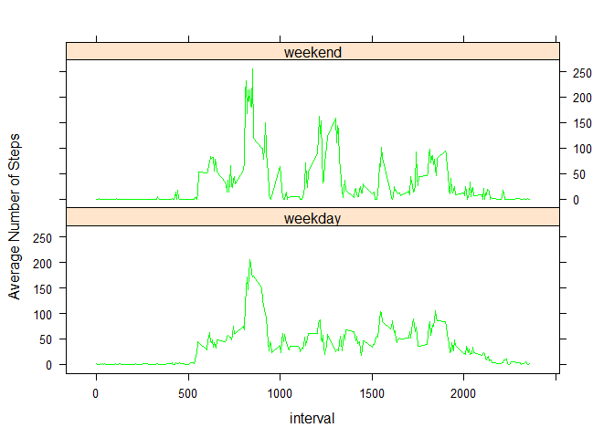

## Loading and preprocessing the data

Load the data

```r
if (!file.exists('activity.csv')) {
  unzip('activity.zip',overwrite=TRUE)
}
activity <- read.csv("activity.csv", header = T, sep = ",")
```


## What is mean total number of steps taken per day?

Calculate the total number of steps taken per day

```r
stepsum <- tapply(activity$steps, activity$date, sum, na.rm=T)
```

Histogram of the total number of steps taken each day

```r
hist(stepsum, xlab = "Number of Steps per Day", ylab = "Number of Days", main = "Steps per Day" , col = "green")
```

<!-- -->

Calculate and report the mean and median of the total number of steps taken per day

```r
mean_stepsum <- round(mean(stepsum))
median_stepsum <- round(median(stepsum))
print(c("Mean",mean_stepsum))
```

```
## [1] "Mean" "9354"
```

```r
print(c("Median",median_stepsum))
```

```
## [1] "Median" "10395"
```


## What is the average daily activity pattern?

Time series plot (i.e. type = "l") of the 5-minute interval (x-axis) and the average number of steps taken, averaged across all days (y-axis)

```r
mean_int <- tapply(activity$steps, activity$interval, mean, na.rm=T)
plot(mean_int ~ unique(activity$interval), type="l", xlab = "5-min interval" , ylab = "Average Steps During Interval" , col = "green")
```

<!-- -->

5-minute interval, on average across all the days in the dataset, which contains the maximum number of steps

```r
mean_int[which.max(mean_int)]
```

```
##      835 
## 206.1698
```


## Inputing missing values

Calculate and report the total number of missing values in the dataset (i.e. the total number of rows with NA).  TRUE = NA in following table.

```r
table(is.na(activity) == TRUE)
```

```
## 
## FALSE  TRUE 
## 50400  2304
```

Devise a strategy for filling in all of the missing values in the dataset. The strategy does not need to be sophisticated. For example, you could use the mean/median for that day, or the mean for that 5-minute interval, etc.

Create a new dataset that is equal to the original dataset but with the missing data filled in.

```r
activity2 <- activity
for (i in 1:nrow(activity)){
    if(is.na(activity$steps[i])){
        activity2$steps[i]<- mean_int[[as.character(activity[i, "interval"])]]
    }
}
```

Histogram of the total number of steps taken each day

```r
stepsum2 <- tapply(activity2$steps, activity2$date, sum, na.rm=T)
hist(stepsum2, xlab = "Number of Steps per Day", ylab = "Number of Days", main = "Steps per Day" , col = "green")
```

<!-- -->

New mean and median total number of steps taken per day

```r
mean_stepsum2 <- round(mean(stepsum2))
median_stepsum2 <- round(median(stepsum2))
print(c("New Mean",mean_stepsum2))
```

```
## [1] "New Mean" "10766"
```

```r
print(c("New Median",median_stepsum2))
```

```
## [1] "New Median" "10766"
```

Impact of imputing missing data on the estimates of the total daily number of steps:
Inputting ~15% of missing values with the mean of the original data set drove the new mean closer to the original median and made both the median and mean values of the new data set equivalent.


## Are there differences in activity patterns between weekdays and weekends?

Create a new factor variable in the dataset with two levels – “weekday” and “weekend” indicating whether a given date is a weekday or weekend day

```r
Sys.setenv(LANGUAGE = "en")
Sys.setlocale("LC_TIME", "English")
```

```
## [1] "English_United States.1252"
```

```r
activity2$weekday <- c("weekday")
activity2[weekdays(as.Date(activity2[, 2])) %in% c("Saturday", "Sunday", "saturday", "sunday"), ][4] <- c("weekend")
activity2$weekday <- factor(activity2$weekday)
```

Make a panel plot containing a time series plot (i.e. type = "l") of the 5-minute interval (x-axis) and the average number of steps taken, averaged across all weekday days or weekend days (y-axis)

```r
activity2_weekend <- subset(activity2, activity2$weekday == "weekend")
activity2_weekday <- subset(activity2, activity2$weekday == "weekday")
mean_activity2_weekday <- tapply(activity2_weekday$steps, activity2_weekday$interval, mean)
mean_activity2_weekend <- tapply(activity2_weekend$steps, activity2_weekend$interval, mean)
library(lattice)
df_weekday <- data.frame(interval = unique(activity2_weekday$interval), avg = as.numeric(mean_activity2_weekday), day = rep("weekday", length(mean_activity2_weekday)))
df_weekend <- data.frame(interval = unique(activity2_weekend$interval), avg = as.numeric(mean_activity2_weekend), day = rep("weekend", length(mean_activity2_weekend)))
df_final <- rbind(df_weekday, df_weekend)
xyplot(avg ~ interval | day, data = df_final, layout = c(1, 2), type = "l", ylab = "Average Number of Steps" , col = "green")
```

<!-- -->
